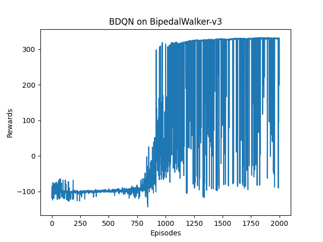

# Branching DQN
> Branching DQN implementation with pytorch based on https://github.com/seolhokim/BipedalWalker-BranchingDQN. 
> It is also sufficiently capable of showing (almost) optimal movements after 1000 episodes in BipedalWalker-v3 environment.
> For better performance in BipedalWalker-v3, I use some tricks mentioned in https://zhuanlan.zhihu.com/p/409553262.
> However it seems fine in other environments without these tricks.:)

## Dependencies
python==3.9.10  
gym==0.18.3  
torch==1.13.1  
*Other versions may also work well. It's just a reference.*  

## Structure
**/data:** contains results of training or testing, including graphs and videos  
**/model:** contains pre-trained models

  
## Train
use:

```bash
python train.py
```

- **--round** for training rounds (default: 2000)
- **--tensorboard** for whether to use tensorboard (default: False)
- **--lr_rate** for learning rate (default: 0.0001)
- **--batch_size** for batch size (default: 64)
- **--gamma** for discounting factor gamma (default: 0.99)
- **--action_scale** for discrete action scale among the continuous action space (default: 50)
- **--env** for which environment to train in (default: BipedalWalker-v3)
- **--save_interval** for interval round to save model(default: 100)
- **--print_interval** for interval round to print evaluation(default: 50)


## Test
use:
```bash
python enjoy.py
```

- **--render** for whether to render (default: True)
- **--round** for evaluation rounds (default: 10)
- **--action_scale** for discrete action scale (default: 50)
- **--load** to specify the model to load in ./model/ (e.g. 2000 for [env]_2000.pth)
- **--env** for which environment to test in (default: BipedalWalker-v3)

P.S. *It is highly recommended to use same **action_scale** and **env** in training and testing. Otherwise the performance in testing could be rather unpredictable.*

## Performance
> **Scores in Training:**  
  
> **Trained Model:**  
