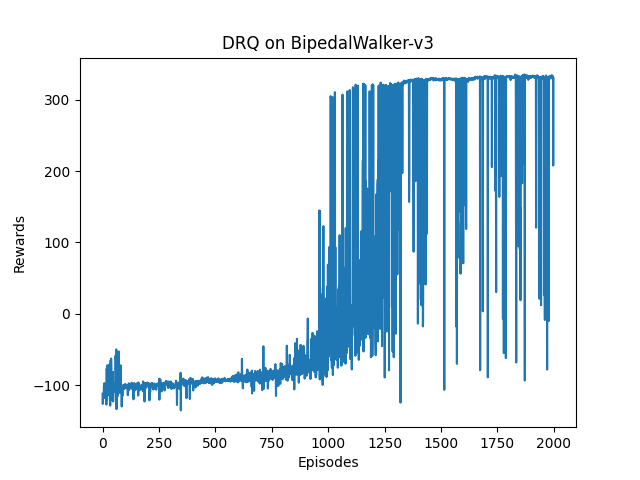

# Branching DQN
> Branching DQN implementation with pytorch based on https://github.com/seolhokim/BipedalWalker-BranchingDQN. 
> It is also sufficiently capable of showing (almost) optimal movements after 1000 episodes in BipedalWalker-v3 environment.
> For better performance in BipedalWalker-v3, I use some tricks mentioned in https://zhuanlan.zhihu.com/p/409553262.
> However it seems fine in other environments without these tricks. :)

## Dependencies
python==3.9.10  
gym==0.18.3  
torch==1.13.1  
*Other versions may also work well. It's just a reference.*  

## Structure
**/data:** contains results of training or testing, including graphs and videos  
**/model:** contains pre-trained models

  
## Train
use:

```bash
python train.py
```

- **--round | -r :** training rounds (default: 2000)
- **--lr_rate | -l :** learning rate (default: 0.0001)
- **--batch_size | -b :** batch size (default: 64)
- **--gamma | -g :** discounting factor gamma (default: 0.99)
- **--action_scale | -a :** discrete action scale among the continuous action space (default: 25)
- **--env | -e :** environment to train in (default: BipedalWalker-v3)
- **--per | -p :** use per  
- **--load | -l :** to specify the model to load in ./model/ (e.g. 25 for [env]_25.pth)  
- **--no_trick | -nt :** not to use tricks  
- **--save_interval | -s :** interval round to save model(default: 1000)
- **--print_interval | -d :** interval round to print evaluation(default: 50)


## Test
use:
```bash
python enjoy.py
```

- **--not_render | -n :** not to render
- **--round | -r :** evaluation rounds (default: 10)
- **--action_scale | -a :** discrete action scale, specifying network to load in ./model/ (default: 25)  
- **--env | -e :** environment to test in (default: BipedalWalker-v3)

## Performance
> **Scores in Training:**  
  
> **Trained Model:**  
